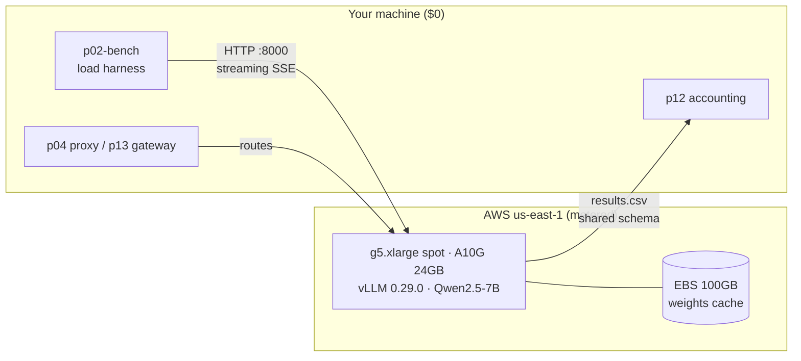
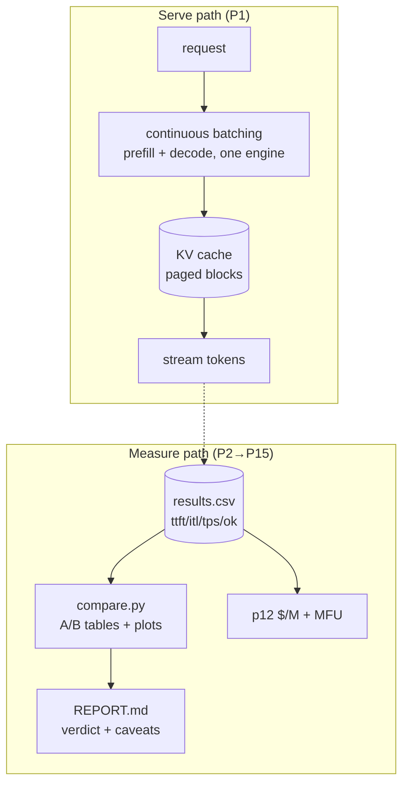

# Inference Track — 15 LLM-serving projects, measured on real GPUs

Self-hosted LLM inference, end to end: serve an open model on a rented GPU,
benchmark it honestly, then work through caching, quantization, speculative
decoding, kernels, scheduling, paging, disaggregation, autoscaling, cost
accounting, gateways, chaos, and a published teardown. **15/15 code-complete,
measured on an A10G, $9.85 of a $128 budget.** New here? Start with
[`BEGINNERS_GUIDE.md`](BEGINNERS_GUIDE.md) — every phase explained with
pictures-in-words, no background assumed.

## Architecture





Every project reuses two contracts: the **results schema**
(`libs/metrics.py::CSV_HEADER`) and the **per-boot ritual**
(`start → work → log-cost.sh → stop.sh`). Full conventions at the bottom.

## Benchmark results (measured, not claimed)

Model Qwen2.5-7B-Instruct FP16 · vLLM 0.29.0 · g5.xlarge spot · workload
512/2048/8192-token prompts × 128 gen × conc 1/8/32 (`runs/20260919-p2/`).

| Scenario | TTFT p50 | TTFT p95 | ITL p95 | Wave tok/s |
|---|---|---|---|---|
| p512 / c1 | 551 ms | 631 ms | 88 ms | 19 |
| p512 / c8 | 719 ms | 806 ms | 97 ms | 191 |
| p512 / c32 | 801 ms | 2,068 ms | 156 ms | 349 |
| p2048 / c1 | 1,665 ms | 2,798 ms | 96 ms | 18 |
| p2048 / c8 | 766 ms | 815 ms | 97 ms | 188 |
| p2048 / c32 | 891 ms | 1,466 ms | 193 ms | 497 |
| p8192 / c1 | 903 ms | 1,246 ms | 95 ms | 23 |
| p8192 / c8 | 1,328 ms | 1,781 ms | 92 ms | 162 |
| p8192 / c32 | 2,018 ms | 5,485 ms | 131 ms | 275 |

Read it: throughput scales ~20× to c32 while p50 TTFT stays under control —
the knee is in the **p95 column**. Headline deltas from later A/B runs
(full tables in each project's README/`runs/`):

| Finding | Number |
|---|---|
| Prefix caching, multi-turn TTFT cut (P4) | **72–75%** |
| AWQ vs FP16: throughput / quality cost (P5) | **~2× / +2.2% ppl** |
| Spec-5 decode speedup @ acceptance (P6) | **2.26× @ 96%** |
| Triton RMSNorm vs torch (P7) | **3.6×** |
| KV predictor error vs live OOM boundary (P3) | **+10%** |
| Kill-replica RTO, no fallback (P14) | **3.1 min** |
| Autoscale 1→2→1 round trip (P11) | **57 s up / ~3 min down** |
| Self-hosted unit cost, 913k tokens (P12) | **$0.59/M** |
| Nulls kept, not hidden | P8 (budget, not flag), P9 (queueing, not eviction), P10 (coloc wins off-saturation) |

## Cost log: $9.85 / $128 (7.7%)

From [`infra/aws/cost-log.csv`](infra/aws/cost-log.csv) — every boot logged
by hand after termination:

| Boot | Hours | Mode | $ | What ran |
|---|---|---|---|---|
| 1 | 1.0 | spot | 0.54 | first serve + P2 full + P4 A/B + P3 attempt |
| 2 | 1.3 | spot | 0.70 | P8 matrix; host reclaimed mid-boot |
| 3 | 0.75 | spot | 0.41 | P3 PASS + P5 fp16 anchor |
| 4 | 2.75 | spot | 1.49 | P5 full matrix + P6 full matrix |
| 5 | 3.75 | spot | 2.03 | P9 matrix, P8-c12, P11/P14 events |
| 6 | 1.3 | spot | 0.70 | P10 partial, P7 bench |
| 7 | 2.5 | spot | 1.35 | P10 handshake deep-dive, P14 throttle pair |
| 8 | 1.0 | on-demand | 1.01 | P10 single-GPU verdict (spot was dry everywhere) |
| 9 | 3.0 | spot | 1.62 | P10 dual verdict, P15 finals, P11 live round trip |

Rules that kept it cheap: spot-only default with $0.70 cap, terminate (never
stop — one-time spot instances *can't* stop), weights re-pulled per boot
(~$0.09, cheaper than EBS retention), one EBS volume per boot, budget alarms
at $40/$70/$100, kill rule at $40 remaining. Two spot reclaims hit us mid-run;
both are filed as P14 field data.

## Setup (tested across 9 boots — this works)

Prereqs: an AWS account, [AWS CLI v2](https://aws.amazon.com/cli/) (`aws sts
get-caller-identity` succeeds), an SSH client, Python 3.10+ with `pip`.
GPU quota is the long pole — request it first (approval took ~1 day here).

```bash
# 0. One-time AWS setup (console, $0): IAM user + access key, then:
aws configure                                  # region us-east-1, json
aws service-quotas request-service-quota-increase --region us-east-1 \
  --service-code ec2 --quota-code L-3819A6DF --desired-value 4   # spot G/VT vCPUs

# 1. One-time console setup: EC2 key pair `vllm-track-key` (chmod 400),
#    security group with 22/8000 from YOUR ip only, $128 budget alarms.

# 2. Clone + local deps
git clone https://github.com/bablu4195-1/inference-track.git && cd inference-track
pip install -r requirements.txt                # harness only; server needs no local deps

# 3. Launch ($0.51/hr starts here — be ready to work)
source infra/aws/launch.env                    # REGION/AZ/AMI/SG checked in
./infra/aws/spot-launch.sh                     # writes infra/aws/.instance-id (gitignored)
./infra/aws/sg-refresh.sh                      # re-run whenever SSH breaks (home IPs rotate)

# 4. Deploy (on the host)
ssh -i infra/aws/vllm-track-key.pem ubuntu@<IP>
  git clone https://github.com/bablu4195-1/inference-track.git ~/track
  cd ~/track && cp p01-serve/vllm.env.example p01-serve/.env   # HF_TOKEN optional: Qwen is ungated
  sudo mkfs -t ext4 /dev/nvme1n1 && sudo mount /dev/nvme1n1 /mnt/hf  # once per boot
  docker compose -f p01-serve/compose.yml up -d
  ./p01-serve/smoke.sh                         # MUST PASS before any experiment

# 5. Measure (from your machine)
python3 p02-bench/bench.py --base-url http://<IP>:8000 --quick   # ~2 min smoke
python3 p02-bench/bench.py --base-url http://<IP>:8000           # full sweep

# 6. Shut it down (every time, no exceptions)
./infra/aws/log-cost.sh 1.5 spot "what you ran"
./infra/aws/stop.sh "session note"             # TERMINATES (one-time spot can't stop)
```

Gotchas earned the hard way (all in [`docs/runbook.md`](docs/runbook.md)):
Intel `aws` binary fails on ARM Macs (`bad CPU type` → `brew install awscli`);
DLAMI root needs ≥75 GB; placeholder `HF_TOKEN` breaks pulls (leave blank);
`depends_on: service_healthy` needs explicit `healthcheck` blocks or workers
never start; vLLM 0.29 removed legacy spec flags and rejects `block-size: 8`.

## Repo map

```text
infra/aws/    launch/start/stop/sg-refresh/log-cost, user-data, EBS runbook
libs/         metrics.py (TTFT/ITL + CSV schema) · vllm_client.py · kv_math.py
p01-serve/    vLLM compose (Qwen2.5-7B, prefix-cache + chunked-prefill on)
p02-bench/    load harness + scenarios + plots          P2  ✅ measured
p03-kvcalc/   live KV monitor + pressure validation     P3  ✅ +10%
p04-prefix-proxy/  hash router + multi-turn A/B        P4  ✅ −72–75%
p05-quant-lab/     FP16/FP8-KV/AWQ matrix + perplexity P5  ✅ AWQ wins
p06-spec-decode/   draft-size matrix + acceptance      P6  ✅ 2.26×/96%
p07-triton-kernel/ fused RMSNorm + bench               P7  ✅ 3.6×
p08-chunked-prefill/ mixed-load matrix                 P8  ✅ null kept
p09-paged-attn/    pressure + REPORT.md                P9  ✅ null kept
p10-disagg/    dual-worker compose + mini proxy        P10 ✅ verdicts
p11-autoscaler/    queue controller + tests            P11 ✅ live 1→2→1
p12-cost-dash/     $/M + MFU accounting + dashboard    P12 ✅ $0.59/M live
p13-ai-gateway/    SLO failover + rate limits + tests  P13 ✅ 16/16
p14-chaos/     fault injectors + SLO burn              P14 ✅ RTO 3.1 min
p15-teardown/  3-config join + repro + REPORT.md       P15 ✅ finals table
runs/          raw CSVs/summaries/plots per GPU run (committed evidence)
docs/          runbook.md · BEGINNERS_GUIDE.md lives at root
```

Conventions: every GPU session ends with `log-cost.sh` + `stop.sh`; every
result row follows `libs/metrics.py::CSV_HEADER`; every boot records AMI /
image digest / model rev in the project README; secrets (`.pem`, `.env`,
`.instance-id`) are gitignored and secret-scanned pre-commit; failed
hypotheses are documented, never deleted.
